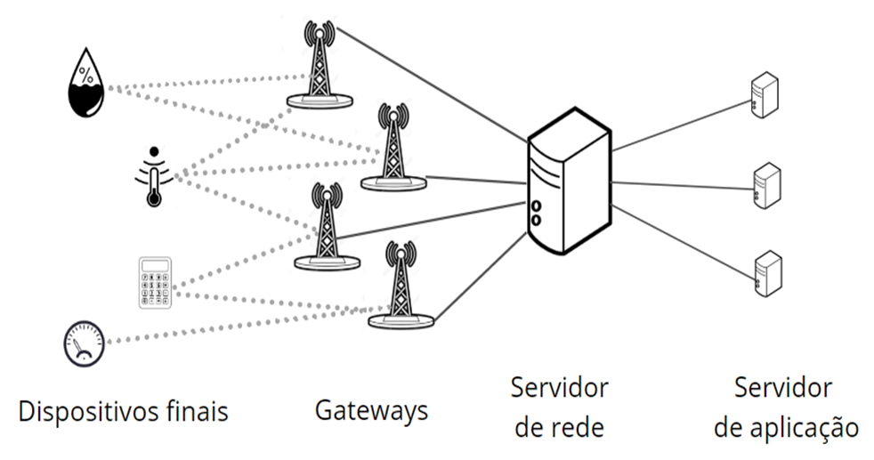
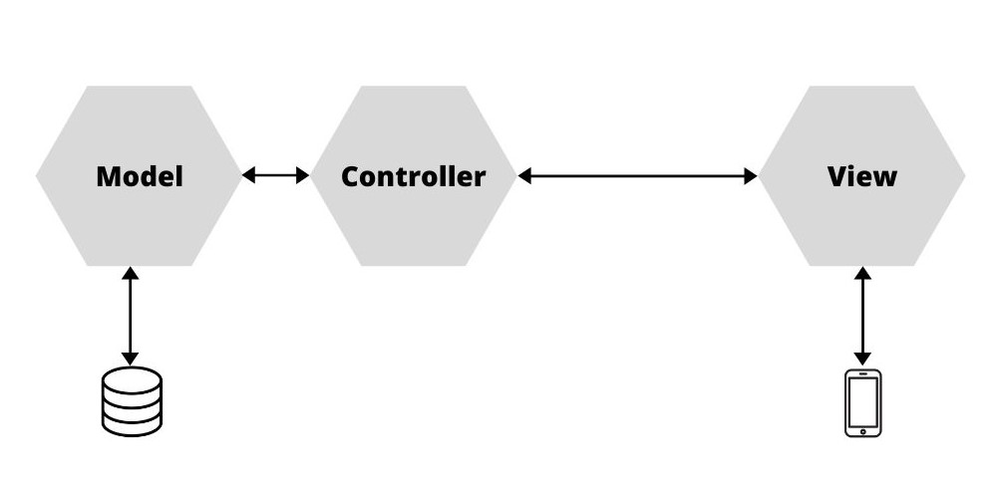
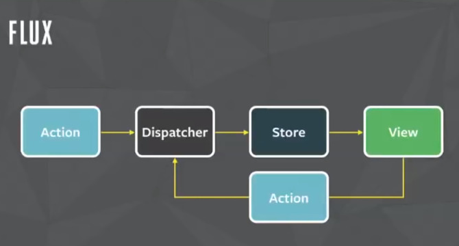

# Smart Park (Aplicação para monitoramento de vagas de estacionamento público)

Esse projeto propõem uma aplicação com o intuito de disponibilizar para os usuários (motoristas), onde se encontram as vagas de estacionamentos livres em uma determinada região que possua um monitoramento. Propõem-se a utilização de sensores LoRaWAN nos quais utilizam o protocolo MQTT para realizar a comunicação com o servidor. A partir do uso do aplicativo, é possivel reduzir o tempo gasto na procura de vagas de estacionamento, consequentemente, reduzindo o congestionamento de carros, e devido ao menos tempo rodando à procura de um lugar disponível, também a redução de CO2.

# Arquitetura

Esse projeto é dividito em três componentes. API do backend, Aplicação móvel, e serviço de comunicação pelo protocolo MQTT. A Arquitetura do sistema é mostrado abaixo:

 T

## API backend

## Aplicação móvel

## Serviço MQTT

## Requerimentos para reprodutibilidade

* Node
* Emulador para android (Foi utilizado bluestacks) ou um aparelho Android
* Android studio (Atualização dos arquivos gradle)
* jdk-8u261-windows-x64
